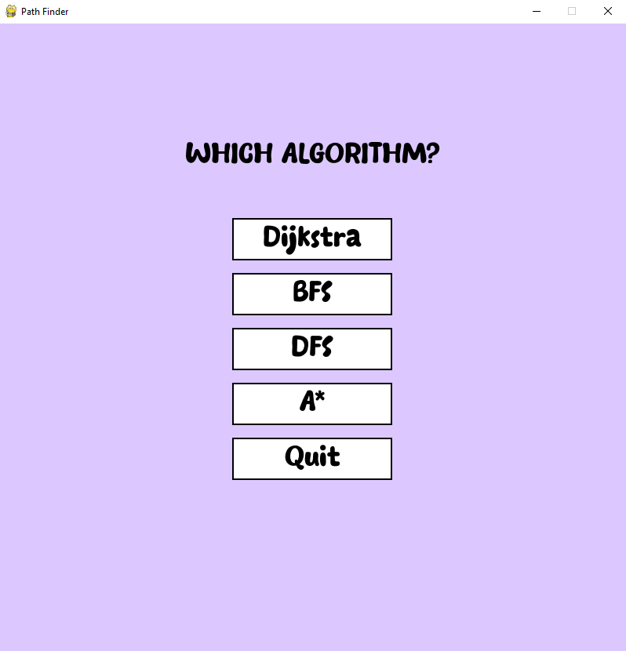
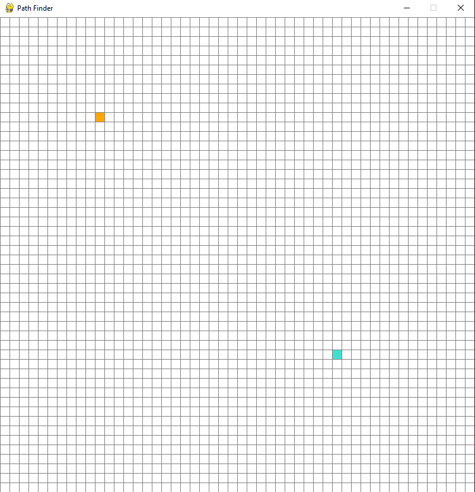
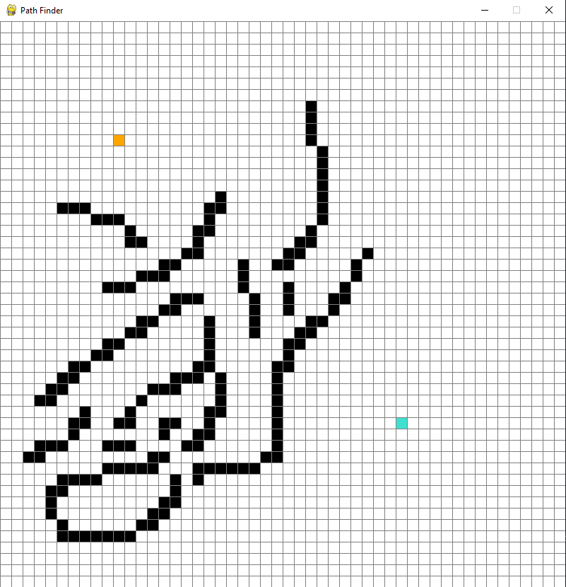
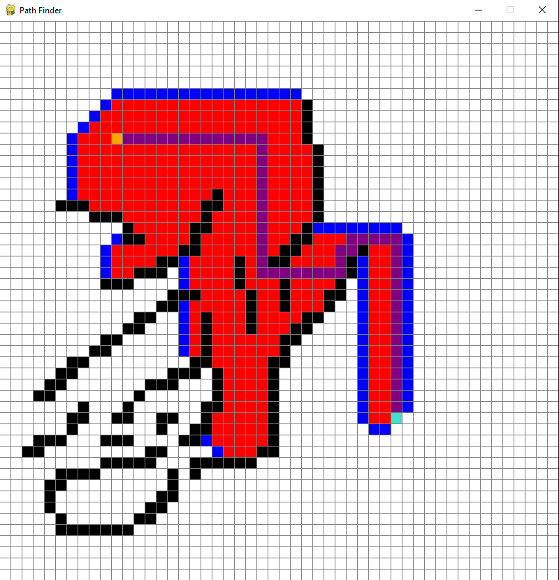

# Pathfinder
A path-finding visualisation that shows multiple selectable algorithms. The goal was to provide a clear and dynamic representation of how the different algorithms find a path between the two points on the grid.

## Algorithms
- Dijsktra's algorithm
- Breadth-First search
- A* algorithm
- Depth-First search

## Prerequisites
Make sure you have Python 3 and pip for Python installed on your machine.

## Installation
- Clone the repository using command 'git clone https://github.com/olly-evans/Pathfinder'
- Navigate to the project folder using 'cd Pathfinder'
- Run 'pip install pygame' to install pygame
- Run 'python main.py' to open the visualisation
  
## Usage
1. Select the algorithm you would like to use using the left mouse button.

2. Left click to place the start point and left click again to place the end point.

3. Now the start and end points have been placed we can place barriers also using left click.

4. If you want to change anything you can hover over any square and right click to return it to its original state.
   
5. When you're happy press the 'space bar' to see the algorithm in action.
Blue squares represent items in the frontier, red squares have been searched already and purple is the path back
to the start that the algorithm has found.

